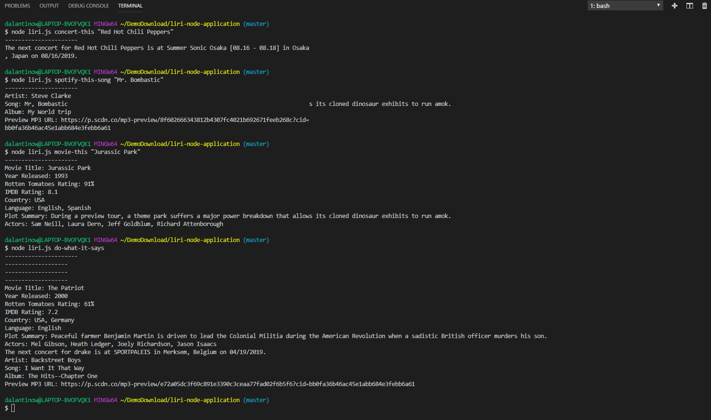

# LIRI-Node-Application

### Overview

This LIRI node app is a language interpretation and recognition interface. It takes in requests through the command line within parameters and gives back a response.

### How to use

1. There are 4 different types of requests.


-"concert-this" followed by an artists name returns the artist's next known concert information


-"spotify-this-song" followed by a song title returns information regarding that song


-"movie-this" followed by a movie title returns information regarding that movie


-"do-what-it-says" calls upon a .txt file and runs one of the previous three functions

2. This app is dependent on the node-Spotify-api, Axios, Moment, DotEnv, and file system npm packages, including the OMDB, Spotify, and Bands In Town APIs.

3. Examples to call this app in the command line:

```
node liri.js concert-this Red Hot Chili Peppers

node liri.js spotify-this-song Mr. Bombastic

node liri.js movie-this Jurassic Park
```
4. 